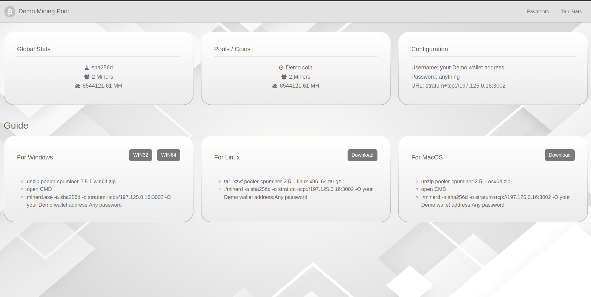

---

# Foundation v2 - Unofficial Frontend for [Foundation Server](https://github.com/blinkhash/foundation-v2-server)

 

Foundation v2 is a sleek and powerful unofficial frontend for the amazing [Foundation Server](https://github.com/blinkhash/foundation-v2-server) mining pool. It aims to provide a seamless user experience for managing your mining pool with real-time data and an intuitive dashboard.




## 🚀 Features

- **Intuitive Dashboard**: Get an overview of your mining pool's performance at a glance.
- **Real-time Data**: Monitor live stats and updates to stay on top of your operations.
- **Responsive Design**: Access your dashboard from any device, anywhere.
- **Single Coin Support**: Specifically designed for single coin mining pools.

## 🛠️ Getting Started

### Prerequisites

- Node.js
- npm
- nvm (Node Version Manager)

### Installation

1. **Clone the Repository**

   ```bash
   git clone https://github.com/raininfotech/foundation-v2-frontend.git
   cd foundation-v2-frontend
   ```

2. **Edit Configuration**
   Update the `next.config.mjs` file in the root folder with your environment variables:

   ```javascript
   SITENAME: 'Foundation v2',
   BASEURL: 'Your Hosting URL',
   APIURL: 'Your Hosting URL/api',
   EXP_URL: 'Coin Explorer URL',
   BACKEND_API: 'Server Backend URL',
   STRATRUM_URL: 'Stratrum URL',
   POOL_NAME: 'Pool Name',
   COIN_NAME: 'Coin Name'
   ```

3. **Switch to Supported Node Version**

   ```bash
   nvm use
   ```

4. **Install Dependencies**

   ```bash
   npm install
   ```

5. **Run the Development Server**

   ```bash
   npm run start
   ```

6. **Build and Start the Production Server**
   ```bash
   npm run build
   npm start
   ```

## 🤝 Contributing

We love contributions! If you have suggestions, bug reports, or want to help build new features, feel free to fork the repo and submit a pull request.

1. **Fork the Repository**
2. **Create a New Branch**
   ```bash
   git checkout -b feature-branch
   ```
3. **Make Your Changes and Commit**
   ```bash
   git commit -m "Description of changes"
   ```
4. **Push to the Branch**
   ```bash
   git push origin feature-branch
   ```
5. **Create a Pull Request**

## 📜 License

This project is licensed under the MIT License - see the [LICENSE](LICENSE) file for details.

## 📞 Contact

For any inquiries or support, feel free to reach out via [email](mailto:sales@raininfotech.com) or open an issue.

---

### 🌟 Show Your Support

If you like this project, please give it a ⭐ on [GitHub](https://github.com/raininfotech/foundation-v2-frontend.git) and share it with your network!

 

---
